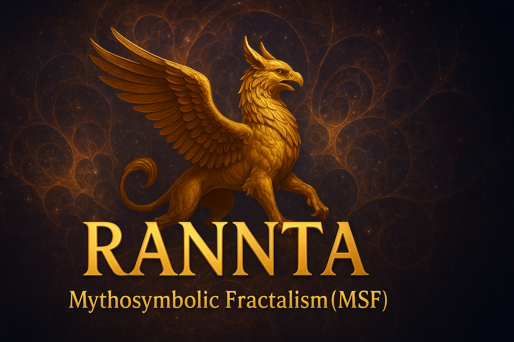

# RANNTA — Mythosymbolic Fractalism (MSF)

---

## ✨ Overview
**Mythosymbolic Fractalism (MSF)** is a visionary art and research framework by **ilia144000**.  
It merges:

- Sacred Geometry  
- Mythological Symbolism  
- Fractal Logic  
- Subconscious Narratives  

This repository provides the **formal specification**, **metadata templates**, and **integrity workflows (C2PA, SHA-256)** for MSF assets.

---

## 📂 Contents
- `metadata/` → NFT metadata (JSON) + creator signature blocks  
- `scripts/` → Integrity & embedding utilities (hash + sign)  
- `examples/` → Sample NFT metadata following MSF spec  
- `CITATION.cff` → Citation metadata (Zenodo DOI integrated)  
- `LICENSE`, `ART_LICENSE`, `CODE_LICENSE` → Licensing details  

---

## 🚀 How to Use
1. Use templates in `/metadata` to register new MSF NFTs.  
2. Run integrity scripts in `/scripts` to embed signatures + hashes.  
3. Register assets automatically via **GitHub Actions workflows**.  
4. Browse official releases with DOI on **Zenodo**.  

---

## 📖 Citation
If you use this specification or related assets, please cite as:  

---

## 🌐 Links
- 🔗 [Official Website](https://rannta.com)  
- 📘 [GitHub Documentation](https://github.com/ilia144000/Mythosymbolic-Fractalism)  
- 📚 [Zenodo DOI](https://doi.org/10.5281/zenodo.16892059)  

---

## 🕊️ RANNTA Origins
**RANNTA Origins** is the first NFT collection introducing **Mythosymbolic Fractalism (MSF)**.  

Each piece embodies encrypted layers of meaning, merging:  
✨ Human-centered creativity  
✨ Sacred geometry  
✨ Mythic archetypes  
✨ Symbolic fractal structures  

The collection represents a **fusion of myth, spirit, and technology** — rare digital artworks designed to inspire reflection and dialogue.  

💚 A significant portion of the proceeds supports:  
- Children’s welfare  
- Environmental restoration  
- Peace promotion worldwide  

---

